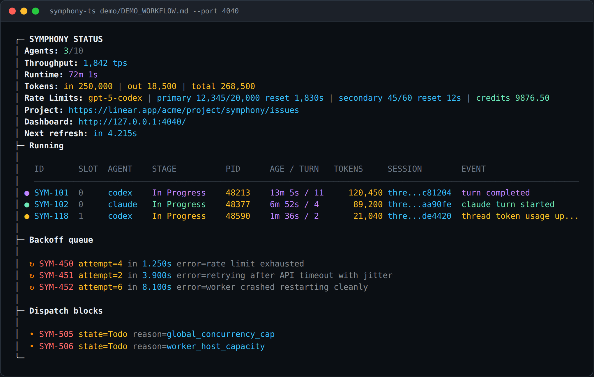
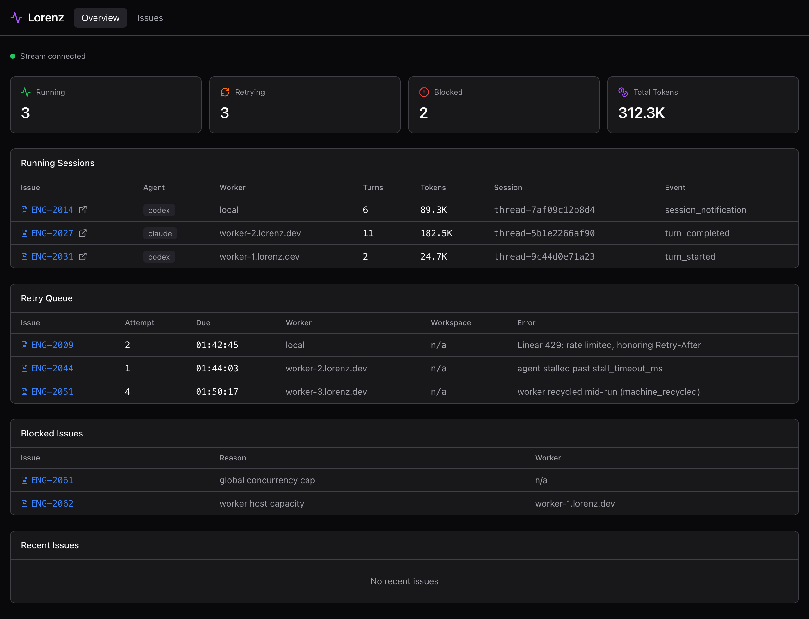

# Lorenz

Lorenz is heavily birthed from [OpenAI's Symphony orchestrator](https://github.com/openai/symphony), reimplemented and extended in TypeScript.

Lorenz turns tracker issues into agent runs. It polls for eligible work, prepares a workspace,
renders the workflow prompt with issue context, starts Codex or Claude, and records the run so
operators can inspect state, retries, cost, and logs.

This repository owns the TypeScript CLI, runtime packages, tracker adapters, terminal dashboard,
local observability server, trace viewer packages, and tests.

## Screenshots

Lorenz ships two operator views over the same runtime snapshot: an Ink terminal
dashboard (TUI) and a web dashboard served by the observability API.

### Terminal dashboard (TUI)



### Web dashboard



## How it works

1. Polls Linear for issues in active states (e.g. `Todo`, `In Progress`)
2. Creates a workspace per issue and bootstraps it via `hooks.after_create`
3. Launches the configured agent executor (Codex or Claude Code) inside the workspace
4. Renders a Liquid-templated prompt from `WORKFLOW.md` with issue context and sends it to the agent
5. Re-runs the agent on subsequent polling cycles if the issue remains active, up to `max_turns`
6. When an issue moves to a terminal state (`Done`, `Closed`, `Cancelled`, `Duplicate`), stops the
   agent and cleans up the workspace

The workflow file (`WORKFLOW.md`) defines both the orchestrator configuration (YAML front matter) and
the agent session prompt (Markdown body). Editing the workflow while Lorenz is running reloads the
configuration automatically - no restart needed.

## Extensions

| Extension                      | What it adds                                                                                                                                                                                                                        |
| ------------------------------ | ----------------------------------------------------------------------------------------------------------------------------------------------------------------------------------------------------------------------------------- |
| Context Ensembles              | Adds configurable multi-agent issue fan-out with per-slot workspaces, prompt/dashboard ensemble context, `ensemble:*` label overrides, and a dedicated `WORKFLOW_ENSEMBLE.md` example for independent workpads.                     |
| Claude Code executor           | Adds `agent.kind: "claude"` support, including Claude CLI execution, JSONL event parsing, built-in `/mcp` tool serving instead of the Python MCP sidecar, authenticated remote worker access, and Claude-specific runtime settings. |
| Workflow and runtime hardening | Defaults Codex workflows to sandboxed `workspace-write`, honors Linear `Retry-After` backoff on `429`, tightens remote workspace path validation, and improves long-running orchestrator reliability.                               |
| Claude parity and MCP handling | Routes Claude and Codex through the same Linear tool backend, removes the Python MCP sidecar, and improves remote cleanup behavior.                                                                                                 |
| Dispatch routing               | Adds tracker-scoped static routing with Linear labels such as `Lorenz:shard-a`, so multiple Lorenz instances can split work by configured route labels.                                                                             |
| Run history CLI                | Adds an orchestrator run history command (`lorenz runs`) exposing completed attempts, retries, token totals, and per-run forensic context beyond live state.                                                                        |
| Secret resolution              | Resolves `op://` references in workflow secrets (e.g. `LINEAR_API_KEY`) through the 1Password CLI.                                                                                                                                  |

## Requirements

[mise](https://mise.jdx.dev/) is recommended for managing Node and pnpm:

```sh
mise trust
mise install
pnpm install
```

The workspace uses Node 24 and pnpm 9 from `mise.toml`.

Runtime requirements depend on the workflow:

- `LINEAR_API_KEY` for Linear-backed workflows.
- `codex` on `PATH` for Codex runs and live Codex tests.
- A Claude ACP bridge, usually `claude-agent-acp`, for Claude runs and live Claude tests.
- SSH access for remote workers and live SSH tests.
- Docker and `ssh-keygen` for disposable live SSH workers when no real SSH hosts are configured.

Run commands from the repository root unless a command says otherwise.

## Run

```sh
pnpm build
pnpm start -- WORKFLOW.md
pnpm start:once -- --dry-run --no-tui WORKFLOW.md
pnpm runs -- --port 4000 --failed
```

The built CLI is `lorenz`:

```sh
lorenz [--once] [--dry-run] [--no-tui] [--port <port>] [--logs-root <path>] [path-to-WORKFLOW.md]
lorenz runs [--issue ID] [--failed] [--cost] [--retries] [--id RUN_ID] [--limit N] [--url URL | --port PORT] [--json]
```

Optional flags:

- `--logs-root <path>` writes logs under `<path>/log/lorenz.log`.
- `--port <port>` starts the local observability dashboard and JSON API.
- `--once` polls once and exits.
- `--dry-run` evaluates candidates without dispatching agents.
- `--no-tui` disables the terminal dashboard and prints JSON snapshots.

With no workflow path, the CLI reads `LORENZ_WORKFLOW`, then `./WORKFLOW.md`.

The runtime reloads the workflow before each poll. If startup cannot read or parse the workflow,
the CLI exits with an error. If a later reload fails, the runtime keeps the last good workflow and
records a `workflow_reload_failed` event.

## Workspace Layout

See [docs/ARCHITECTURE.md](./docs/ARCHITECTURE.md) for the layering rules and the tracker extension
contract (including the recipe for adding a new tracker backend).

- `apps/cli` is the composition root: it invokes the built-in extensions' registration and wires
  configuration, agent runners, the runtime, the TUI, and the observability server into the
  shipped binary.
- `apps/traceviz` renders trace event streams for local inspection.
- `packages/tracker-sdk` is the extension SDK: the `TrackerProvider` contract, the provider
  registry, and the helpers tracker backends build on.
- `extensions/*` are the backend extensions: `linear-tracker`, `local-tracker`,
  `memory-tracker`, and `jira-tracker` are self-contained tracker providers (config
  parsing, runtime client, tool packs) that each export their own registration; the CLI
  invokes the built-in set at its composition root.
- The remaining `packages/*` are the provider-agnostic engine: domain model, configuration
  loader, prompt renderer, runtime, policies, MCP server, dashboards, logging, SSH, and
  support libraries.
- `test/` contains workspace-level integration, contract, sandbox, and live tests.
- Package- and app-owned unit tests live under `packages/<name>/test/` or `apps/<name>/test/` as
  `.test.ts` or `.test.tsx` files.

Create a package when a boundary has a clear owner. Keep curated exports in `src/index.ts` and
declare internal dependencies as `workspace:*`.

## Configuration

Configuration lives in the YAML front matter of a workflow file. The Markdown body below the front
matter is the agent session prompt, rendered as Liquid with issue context variables.

### Quickstart

```yaml
---
tracker:
  kind: linear
trackers:
  linear:
    provider: linear
    project_slug: "your-project-slug"
workspace:
  root: ~/code/workspaces
hooks:
  after_create: |
    git clone git@github.com:your-org/your-repo.git .
agent:
  kind: codex
---

You are working on {{ issue.identifier }}: {{ issue.title }}

{{ issue.description }}
```

Set `LINEAR_API_KEY` in your environment before running a Linear workflow.

### Full Reference

```yaml
---
tracker:
  kind: linear # linear, jira, jira-mcp, local, or memory
trackers:
  linear:
    provider: linear
    api_key: $LINEAR_API_KEY # defaults to $LINEAR_API_KEY when unset
    endpoint: "https://api.linear.app/graphql"
    project_slug: "my-project" # right-click a Linear project and copy the URL slug
    assignee: $LINEAR_ASSIGNEE # optional; filters issues by assignee
    active_states:
      - Todo # default: ["Todo", "In Progress"]
      - In Progress
      - Agent Review
      - Merging
      - Rework
    terminal_states:
      - Closed # default: ["Closed", "Cancelled", "Canceled",
      - Cancelled #           "Duplicate", "Done"]
      - Canceled
      - Duplicate
      - Done
    dispatch:
      accept_unrouted: true # accept issues without a route label; default: true
      only_routes: null # null accepts any route, [] accepts none
      route_label_prefix: "Lorenz:" # route labels look like "Lorenz:backend"

tools:
  local:
    path: .lorenz/local # explicit extra pack config; not needed for Linear-owned tools

polling:
  interval_ms: 30000 # default: 30000

workspace:
  root: ~/code/workspaces # default: $TMPDIR/lorenz_workspaces

worker:
  # Either list static SSH hosts here, or set kind to select a top-level workers.<name> profile.
  # kind: static-prod
  ssh_hosts:
    - worker1.example.com # standard OpenSSH targets and Host aliases work
    - worker2.example.com:2222
  ssh_timeout_ms: 60000 # default: 60000
  max_concurrent_agents_per_host: 2 # optional; defaults to the global agent cap per host
  # Alternative to ssh_hosts (mutually exclusive): a warm pool of leased workers
  # provisioned by a worker driver. Disabled by default.
  worker_pool:
    enabled: false
    # driver: fake # compatibility fallback when worker.kind is omitted
    min: 0 # warm-inventory floor the reaper keeps alive
    max: 1 # ceiling on concurrent workers
    warm: 1 # pre-warmed idle workers the reaper tops up toward
    max_in_flight: 1 # run slots per machine; >1 requires co_residence: true
    ttl_ms: 3600000 # hard worker lifetime before recycle
    idle_reap_ms: 300000 # idle window before a warm worker above min is reaped
    acquire_timeout_ms: 30000 # how long an acquire waits for capacity
    spend: # optional caps, all in worker count / wall-clock worker-seconds
      max_concurrent_workers: 4
      max_worker_seconds: 86400
      daily_worker_seconds: 28800

workers:
  static-prod: # selected by worker.kind, options pass through verbatim (snake_case preserved)
    driver: static-ssh
    ssh_hosts: ["user@worker1:22"]

agent:
  kind: codex # default: "codex"; "claude" is configured below
  max_concurrent_agents: 10 # default: 10
  max_turns: 20 # default: 20
  max_retry_backoff_ms: 300000 # default: 300000
  ensemble_size: 1 # default: 1
  skills: # skill directories copied to .lorenz/skills/ before the agent starts
    - ./skills/lorenz-land # one entry per skill directory

agents:
  turn_timeout_ms: 3600000 # default: 3600000
  stall_timeout_ms: 300000 # default: 300000
  codex:
    executor: acp
    bridge_command: codex-acp
  claude:
    executor: acp
    bridge_command: claude-agent-acp
    bridge_args:
      - --permission-mode
      - dontAsk
      - --model
      - claude-opus-4-6[1m]

status_overrides:
  in progress:
    agent:
      max_concurrent_agents: 5
  merging:
    agent:
      max_concurrent_agents: 2

codex:
  command: codex-acp # legacy alias for agents.codex.bridge_command
  turn_timeout_ms: 3600000 # default: 3600000
  stall_timeout_ms: 300000 # default: 300000

claude:
  command: claude-agent-acp # ACP bridge command
  model: claude-opus-4-6[1m]
  permission_mode: dontAsk
  strict_mcp_config: true # default: true

hooks:
  after_create: | # runs after a workspace directory is created
    git clone --depth 1 git@github.com:org/repo.git .
  before_run: | # runs before each agent turn
    git pull origin main
  after_run: | # best effort; runs after each agent turn
    echo "turn complete"
  before_remove: | # best effort; runs before workspace cleanup
    echo "cleaning up"
  timeout_ms: 60000 # default: 60000

observability:
  dashboard_enabled: true # terminal dashboard; default: true
  refresh_ms: 1000 # default: 1000
  render_interval_ms: 16 # default: 16

server:
  port: 4000 # enables the web dashboard; default: disabled
  host: 127.0.0.1 # default: 127.0.0.1

logging:
  log_file: ./log/lorenz.log # default: ~/.lorenz/log/lorenz.log
---
```

Notes:

- `tracker.kind` is always required. When `trackers` is present it selects a named bundle, and
  `trackers.<name>.provider` selects the tracker implementation.
- The older flat `tracker.kind: linear` shape is still accepted when no `trackers` map is present.
- `trackers.linear.project_slug`, `trackers.linear.project_slugs`, or
  `trackers.linear.project_labels` is required for Linear workflows.
- `trackers.linear.api_key` falls back to `LINEAR_API_KEY`; `trackers.linear.assignee` falls back
  to `LINEAR_ASSIGNEE`.
- Shared tracker secrets can use `op://` references when the 1Password CLI is installed.
- `tools.<pack>` mounts or configures extra tool packs. Tracker-owned tools are implicit, so a
  Linear tracker does not need a matching `tools.linear` entry.
- `workspace.root` supports `~` and whole-value `$VAR` expansion. `LORENZ_WORKSPACE_ROOT`
  overrides `workspace.root` at runtime.
- `LORENZ_SSH_CONFIG` points SSH worker commands at a custom OpenSSH config file.
- Hooks run through `bash -lc` locally or over SSH with the workspace as `cwd`. Use
  fail-fast shell options in bootstrap hooks so clone and dependency setup failures stop workspace
  creation immediately.
- `codex.command` runs through `bash -lc`, so shell expansion happens in the launched process.
- If the Markdown body is blank, Lorenz uses a default prompt with the issue identifier, title,
  and body.

## Linear

Prerequisites:

1. Create a personal API token in Linear Settings, Security & access, Personal API keys.
2. Export it as `LINEAR_API_KEY`, or set `trackers.linear.api_key: $LINEAR_API_KEY`.
3. Find the project slug by right-clicking a Linear project and copying its URL. The slug is in the
   path.
4. The example workflows use non-standard states such as `Agent Review`, `Rework`, `Human Review`,
   and `Merging`. Add those states under Team Settings, Workflow, or adjust `active_states` and
   `terminal_states` to match your team.

Route labels let multiple Lorenz instances share one Linear project. With the default
`route_label_prefix`, labels such as `Lorenz:backend` and `Lorenz:frontend` become route names.

## Trackers

A tracker is the source of issues Lorenz works on. `tracker.kind` selects a named bundle under
`trackers`, and the selected bundle's `provider` selects the implementation. Every tracker exposes
the same read surface to the runtime (poll for candidate issues, refresh in-flight issues by id)
and a set of agent tools. Those tools are read+write symmetric across kinds, mirroring
`linear_graphql` (which both reads and writes): each tracker gives the agent at least one write tool
and one read tool. The tools differ per kind; their descriptions are self-documenting and surface
to the agent via the MCP `tools/list` call.

Supported kinds:

- `linear` - issues live in a Linear project. Read access uses `trackers.linear.api_key` (resolved
  from `LINEAR_API_KEY`) and project selection uses `trackers.linear.project_slug`,
  `trackers.linear.project_slugs`, or `trackers.linear.project_labels`. Agents can use
  provider-neutral `tracker_*` tools or the legacy
  `linear_graphql` tool.
- `jira` - issues live in Jira Cloud and are accessed directly over Jira REST. Configure
  `trackers.jira.base_url`, `trackers.jira.email`, `trackers.jira.api_key`, and either
  `trackers.jira.project_keys` or `trackers.jira.jql`. `JIRA_BASE_URL`, `JIRA_EMAIL`, and
  `JIRA_API_KEY` are used as fallbacks.
- `jira-mcp` - issues live in Jira, but Lorenz reaches them through an external MCP server.
  Configure `trackers.jira-mcp.mcp.url` and either `trackers.jira-mcp.project_keys` or
  `trackers.jira-mcp.jql`. Tool names can be overridden under `trackers.jira-mcp.mcp.tools`.
- `local` - issues live as Markdown files on disk. No external service required.
- `slack` - an @-mention of the bot (in a channel message or a thread reply) is an issue, the
  thread carries the status (`@bot !` commands and bot `status:` replies), and a thread reply is
  a comment.
- `memory` - an in-process tracker used for tests and dry runs.

All non-memory providers expose the provider-neutral agent tools:

- `tracker_read_issue`
- `tracker_query`
- `tracker_update_status`
- `tracker_list_comments`
- `tracker_comment`
- `tracker_update_comment`
- `tracker_create_issue`

Provider-specific tools are compatibility escape hatches, not the preferred workflow contract.

All kinds share the dispatch routing block under the selected tracker bundle:

```yaml
tracker:
  kind: linear
trackers:
  linear:
    provider: linear
    dispatch:
      accept_unrouted: true # process issues that carry no matching route label (default)
      only_routes: null # or a list of route names this instance handles
      route_label_prefix: "Lorenz:" # the label prefix that names a route
```

### Jira tracker

For both `jira` and `jira-mcp`, Lorenz only picks up issues that are assigned to the configured
user (`trackers.jira.assignee` or `trackers.jira-mcp.assignee`, defaulting to the authenticated
user via `assignee = currentUser()`) and labeled `agent`. This holds even when the configured JQL
widens the scope, so issues must be explicitly delegated before Lorenz will dispatch them.
Jira REST issues created through `tracker_create_issue` are assigned to that same owner by
default. Jira MCP creation forwards a concrete configured or caller-provided `assignee` to the
external MCP server.
Jira REST supports the same persistent workpad-comment flow as Linear through
`tracker_list_comments`, `tracker_comment`, and `tracker_update_comment`. Jira MCP maps those
neutral comment tools to `jira_get_comments`, `jira_add_comment`, and `jira_update_comment` by
default; override `trackers.<name>.mcp.tools.list_comments` or `update_comment` when the external
MCP server uses different tool names.

Direct Jira REST configuration:

```yaml
tracker:
  kind: jira
trackers:
  jira:
    provider: jira
    base_url: https://example.atlassian.net
    email: $JIRA_EMAIL
    api_key: $JIRA_API_KEY
    project_keys: ["ENG"]
    # Optional provider-native scope. When present, Lorenz combines it with active_states.
    # jql: 'project = ENG AND labels in ("lorenz")'
```

Jira via an external MCP server:

```yaml
tracker:
  kind: jira-mcp
trackers:
  jira-mcp:
    provider: jira-mcp
    base_url: https://example.atlassian.net # optional; used for issue URLs when MCP payloads omit them
    project_keys: ["ENG"]
    mcp:
      url: http://127.0.0.1:5123/mcp
      token: $JIRA_MCP_TOKEN
      tools:
        search: atlassian_search_jira
        read_issue: atlassian_get_jira_issue
        update_status: atlassian_transition_jira_issue
        list_comments: atlassian_get_jira_comments
        comment: atlassian_add_jira_comment
        update_comment: atlassian_update_jira_comment
        create_issue: atlassian_create_jira_issue
```

### Local tracker (filesystem board)

The local tracker runs Lorenz against a directory of Markdown files, with no Linear API key or
workspace. See `WORKFLOW.local.md` for a complete example workflow.

Configure it with `kind: local` and a board `path` (default `.lorenz/local`):

```yaml
tracker:
  kind: local
trackers:
  local:
    provider: local
    path: .lorenz/local
    id_prefix: "BOARD-" # optional, default "BOARD-"
    active_states:
      - Todo
      - In Progress
    terminal_states:
      - Done
      - Cancelled
```

Both `path` and `id_prefix` are local-specific and always defaulted, so a local workflow is valid
with just `kind: local`. `id_prefix` sets the issue-id prefix for the board: the tracker only treats
`<prefix><n>.md` files as issues and mints new ids with it, so one board can be `BOARD-1`, `BOARD-2`
and another `XXX-1`, `FEAT-1`, etc. It must be filesystem-safe (start alphanumeric, then only
letters, digits, `_` or `-`); an unsafe prefix is rejected at config load. Changing the prefix of an
existing board orphans files written under the old prefix (they stop matching), so set it up front.

Each issue is one file named `<prefix><n>.md` (for example `.lorenz/local/BOARD-7.md`, or
`.lorenz/local/XXX-7.md` with `id_prefix: "XXX-"`). The identifier is the file stem (`BOARD-7`).
The format is YAML front matter followed by a `# Title`
heading, the description, and an optional `## Comments` section:

<!-- prettier-ignore -->
```markdown
---
status: In Progress
labels:
  - backend
---

# Fix the retry queue

The retry slot is not released when a worker fails.

<!-- lorenz:comments -->
## Comments
- 2026-05-29T12:00:00.000Z agent: Reproduced the leak; fix in progress.
```

- `status` (required) is the issue state. Active states (`Todo`, `In Progress`) mean the issue is
  available to work; terminal states (`Done`, `Cancelled`) mean it is finished and must not be
  reopened. Configure the exact sets with `active_states` / `terminal_states`.
- `labels` (optional) is a YAML list. Labels feed dispatch routing the same way Linear labels do.
- The `# Title` heading is the issue title; the text below it is the description.
- The `## Comments` section is managed by the `local_comment` tool. The hidden
  `<!-- lorenz:comments -->` marker delimits it so a description that itself contains a
  `## Comments` heading is never misparsed; treat the most recent comment block as the live
  workpad.

Agent tools for `kind: local` (read and write, symmetric with `linear_graphql`):

- `local_update_status` - move an issue to a new status (args: `issueId`, `status`).
- `local_comment` - append a progress note to the issue's `## Comments` section (args: `issueId`,
  `body`).
- `local_create_issue` - create a new board issue for out-of-scope follow-up work (args: `title`,
  optional `body`, optional `status`).
- `local_read_issue` - read an issue's authoritative state: its current status, title, description,
  and comments (args: `issueId`). Use it to re-read state and recover prior progress notes on a
  continuation turn.

Concurrent writes (multiple agents or ensemble slots) to the same board file are serialized
in-process so a status change and comments are never lost. This assumes a single Lorenz daemon
owns the board; editing the `BOARD-<n>.md` files from another process at the same time is out of
scope.

To seed a board so you can try `kind: local` immediately, use the demo seeder, which writes
sample `BOARD-<n>.md` files through the same `BoardStore` the running tracker uses:

```sh
npx tsx sandbox/seed-local.ts                    # seeds ./.lorenz/local
npx tsx sandbox/seed-local.ts /tmp/demo-board    # seeds an explicit directory
npx tsx sandbox/seed-local.ts .lorenz/local 2  # seeds only the first 2 issues
npx tsx sandbox/seed-local.ts /tmp/demo-board 3 XXX-  # seeds XXX-1..XXX-3 (match trackers.local.id_prefix)
```

Point `trackers.local.path` at the directory you seeded and run Lorenz as usual. If you set a
custom `id_prefix`, pass the same prefix to the seeder so the seeded ids match what the tracker
expects.

### Slack tracker (mention + thread commands)

The Slack tracker treats an @-mention of a bot as an issue - in a channel message or in a thread
reply (a reply mention tracks its thread, anchored at the root, with the reply as the request).
The request's text is the issue title/description, threaded replies are comments, and the
issue's STATUS lives in the thread: the bot posts `status: <Name>` replies and humans transition
with `@bot !` command mentions; the latest event wins, and the bot mirrors the state onto its own
reaction for glanceability. See `WORKFLOW.slack.md` for a complete example workflow.

Set up a Slack app:

1. Create a Slack app at <https://api.slack.com/apps> (from scratch) in your workspace.
2. Under "OAuth & Permissions", add these **bot token scopes**:
   - `channels:history` - read messages in public channels.
   - `groups:history` - read messages in private channels (only if you watch private channels).
   - `reactions:read` - read reactions (legacy status fallback and the tracking marker).
   - `reactions:write` - mirror status onto the bot's own reaction and mark tracked threads.
   - `chat:write` - post threaded replies (comments and `status:` transitions).
   - `users:read` - resolve user ids to names for the `slack_user_info` tool (optional but
     recommended).

   Lorenz discovers issues by paging `conversations.history` and matching the bot's @-mention
   in message text, so it does not need `app_mentions:read`. Only add that scope if you separately
   wire up the Events API / `app_mention` subscription, which Lorenz does not use today.

   `conversations.history` is rate-limited (newer non-Marketplace apps can be throttled to roughly
   one request per minute), and each poll re-scans recent channel history. The shipped Slack
   workflow therefore sets a conservative `polling.interval_ms` of `60000` (one minute), and you
   should point it at dedicated, low-traffic channels so a busy channel does not trigger sustained
   `429`s. The transport's `429`/`Retry-After` backoff and per-channel `poll_error` handling cover
   transient limits on top of that.

3. Install the app to the workspace and copy the **Bot User OAuth Token** (starts with `xoxb-`).
   Export it as `SLACK_BOT_TOKEN`; Lorenz resolves it into `trackers.slack.api_key`.
4. Find the app's **bot user id** (the `U...` id, shown on the app's "App Home" / via
   `auth.test`). Export it as `SLACK_BOT_USER_ID` and reference it as
   `trackers.slack.bot_user_id`.
5. Invite the bot to each channel you want it to watch (`/invite @your-bot`). A bot only sees
   `*:history` for channels it has joined.
6. Collect the **channel IDs** (`C...`, from the channel's "About" panel) for those channels and
   list them under `trackers.slack.channels`.

Configure it with `kind: slack`:

```yaml
tracker:
  kind: slack
trackers:
  slack:
    provider: slack
    channels:
      - C0123456789
    bot_user_id: $SLACK_BOT_USER_ID
    emoji_states:
      eyes: In Progress
      white_check_mark: Done
      x: Cancelled
    active_states:
      - Todo
      - In Progress
    terminal_states:
      - Done
      - Cancelled
```

`SLACK_BOT_TOKEN` (the bot token), a non-empty `channels` list, and `trackers.slack.bot_user_id`
(`SLACK_BOT_USER_ID`) are all **required**. The bot user id scopes issue creation to the bot's own
mentions: only messages that mention that exact user become issues, and only that leading mention
is stripped from the title. It is required so that ordinary human-to-human `<@U...>` mentions in a
watched channel never spawn agents or expose their text to workers. If it is unset or resolves
empty, config validation fails and the production transport fails closed (it scans nothing).
Channel entries resolve `$VAR` references the same way `bot_user_id` does.
`trackers.slack.assignee` is rejected for `kind: slack`: messages carry no assignee, so an
assignee-partitioned deployment would otherwise silently dispatch everything everywhere.

The issue identifier is the message reference in `<channel>:<ts>` form (for example
`C0123456789:1717000000.000100`); that is the `issueId` passed to the write tools. Issues also
carry a permalink (`{{ issue.url }}`, dashboard links) built from the workspace URL that
`auth.test` reports, and `slack_read_thread` returns the same permalink for linking the source
message from commits and PRs.

Status is derived from the issue's thread: the bot's own `status: <Name>` replies (posted by
`slack_update_status`) and human command mentions are ts-ordered events, and the latest wins.
The human commands are:

- `@bot !done` / `@bot !cancel` / `@bot !in progress` / `@bot !todo` - transition to the
  standard state.
- `@bot !status <Name>` - transition to any configured active/terminal state (custom names
  too).
- `@bot !reopen` - back to the first active state.
- Any other `@bot` mention on a terminal issue re-opens it: mentioning the bot again always
  means "this needs attention".

Reactions are per-author in Slack (the bot cannot remove a human's reaction and vice versa), so
they are only the bot's visibility mirror, controlled by `emoji_states` (`:eyes:` ->
`In Progress`, `:white_check_mark:` -> `Done`, `:x:` -> `Cancelled` by default). Threads that
have never seen a status event fall back to the reaction-derived reading, so reaction-managed
threads keep working. Two optional keys tune tracking: `marker_emoji` (default `robot_face`) is
the reaction the bot drops on a reply-tracked thread's root, and `reply_lookback_days` (default
`2`) bounds how far back untracked threads are inspected for new reply-mention requests.

Agent tools for `kind: slack`, served by the `slack` tool pack (mounted by default alongside the
provider-neutral `tracker` pack):

- `slack_update_status` - set the issue's status by posting the bot's authoritative `status:`
  thread reply, then mirror the bot's reaction (args: `issueId`, `status` - any configured
  active/terminal state name).
- `slack_comment` - post a threaded reply on the source message as a comment (args: `issueId`,
  `body`).
- `slack_read_thread` - read the issue's authoritative state: thread-derived status, source
  message, request reply (for thread-tracked issues), reactions, permalink, and all replies
  (args: `issueId`). Use it to re-read state, catch new human replies/commands, and recover
  prior progress notes on a continuation turn.
- `slack_query` - read-only query over the tracked issues in the watched channels (bot-mention
  roots plus bot-marked threads), with thread-derived state: filter with the shared JSON
  predicate DSL, project fields, order, and page; `expand` adds `thread` and `reactions` (args:
  `channels?`, `where?`, `select?`, `expand?`, `order_by?`, `limit?`, `offset?`).
- `slack_user_info` - resolve a `U...` user id to its profile: name, real name, display name,
  bot flag (args: `userId`).
- `slack_channel_context` - read the channel conversation around a tracked issue's source
  message, ascending (args: `issueId`, `before?` default 10 max 50, `after?` default 10 max 50).

There is no `slack_create_issue`, and the neutral `tracker_create_issue` reports itself as
unavailable on Slack: issues are created by humans @-mentioning the bot, not by the agent.

Routing note: Slack issues carry only hashtag-derived labels (a `#tag` in the message text
becomes the label `tag`); they are not otherwise routed or assigned. Dispatch treats a label as a
route only when it starts with `route_label_prefix`, so the Slack workflow sets
`route_label_prefix: route-`. Tag a message `#route-<name>` to route it: `#route-backend` becomes
the label `route-backend`, which dispatch resolves to the route `backend` (set `only_routes`
accordingly). Plain hashtags such as `#backend` stay non-route labels; with the default
`accept_unrouted: true` all Slack mentions are still picked up.

## Workflow Prompt

The prompt body can read these public issue and run fields:

- `{{ issue.identifier }}`
- `{{ issue.title }}`
- `{{ issue.description }}`
- `{{ issue.state }}`
- `{{ issue.state_type }}`
- `{{ issue.labels }}`
- `{{ issue.url }}`
- `{{ issue.id }}`
- `{{ issue.priority }}`
- `{{ issue.branch_name }}`
- `{{ issue.assignee_id }}`
- `{{ issue.created_at }}`
- `{{ issue.updated_at }}`
- `{{ issue.assigned_to_worker }}`
- `{{ issue.blocked_by }}`
- `{{ attempt }}`
- `{{ ensemble.enabled }}`
- `{{ ensemble.slot_index }}`
- `{{ ensemble.size }}`

Workspace tests render representative Liquid constructs: conditionals, null fallbacks, loops,
`forloop` metadata, nested blocker refs, and common filters.

## Skills

The `skills/` directory in this repo contains orchestration skills referenced by the example
workflow files:

- `lorenz-commit` produces clean, logical commits.
- `lorenz-push` pushes branches and creates or updates PRs.
- `lorenz-pull` merges the latest `origin/main` into a working branch.
- `lorenz-land` monitors and merges approved PRs.
- `lorenz-debug` investigates stuck runs and execution failures.

Lorenz copies skills into `.lorenz/skills/` in each prepared workspace before the agent starts.
A `.gitignore` containing `*` is written alongside the copied skills so they are never committed.
Skills come from two places:

- **`agent.skills`** - a list of skill directories you maintain. Each entry is one skill directory
  (e.g. `./skills/lorenz-land`) and is copied to `.lorenz/skills/<directory-name>`. Relative
  paths resolve from the workflow file directory.
- **Tool packs** - a mounted tool pack can bundle the skill that documents it, so the skill ships
  automatically when the tool is in use. The Linear pack bundles `lorenz-linear` (raw Linear
  access via the injected `linear_graphql` tool for Codex or the `/mcp` endpoint for Claude), so
  enabling Linear tools overlays that skill without listing it under `agent.skills`.

It is up to the user to reference `.lorenz/skills` in their WORKFLOW.md (or the agent's
equivalent configuration) so the agent knows where to find the overlaid skills at runtime.

## Observability

The terminal dashboard shows agents, throughput, runtime, token usage, rate limits, running
sessions, retry queue, and dispatch blocks. The web dashboard exposes the same runtime snapshot
through a local HTTP server.

Start the web dashboard with `--port` or `server.port`:

```sh
pnpm start -- WORKFLOW.md --port 4000
```

API routes:

- `/`
- `/api/v1/state`
- `/api/v1/runs`
- `/api/v1/runs?id=<run-id>`
- `/api/v1/refresh`
- `/api/v1/:issue_identifier`

Live updates (ops state and trace events) stream over the `/ws` WebSocket endpoint.

Claude sessions use `/mcp` for injected dynamic tools when the runtime has started an
observability server. The server also starts automatically for Claude workflows so the ACP bridge
can reach those tools.

`lorenz runs` queries the same API for run history, cost summaries, retry summaries, and raw
JSON output.

## Testing

```sh
mise run tidy
mise run check
```

`mise run tidy` formats and applies lint fixes. `mise run check` runs typecheck, build, tests, and
lint.

Useful direct commands:

```sh
pnpm typecheck
pnpm build
pnpm lint
pnpm test
pnpm test:watch
```

When running Vitest directly, rebuild first so tests exercise the current compiled packages.

## Live Tests

Live tests are opt-in and launch real CLIs or services in isolated workspaces.

```sh
pnpm test:live:codex
pnpm test:live:linear-codex
pnpm test:live:claude
pnpm test:live:ssh
pnpm test:live:linear-sandbox
```

`pnpm test:live` runs the Codex, Linear plus Codex, and Claude live tests.

Environment knobs:

- `LORENZ_TS_CODEX_ACP_COMMAND` overrides the Codex ACP bridge command for live tests.
- `LORENZ_TS_CLAUDE_ACP_BRIDGE_COMMAND` enables Claude live tests.
- `LORENZ_TS_CLAUDE_ACP_BRIDGE_ARGS` supplies Claude ACP bridge args as a JSON string array.
- `LINEAR_API_KEY` is required for Linear live tests and MCP canaries.
- `LINEAR_PROJECT_SLUG` selects the Linear project for `pnpm test:live:linear-codex`.
- `LORENZ_LIVE_SSH_WORKER_HOSTS` is a comma-separated list of real SSH workers.
- When `LORENZ_LIVE_SSH_WORKER_HOSTS` is unset, the SSH live test can use disposable local
  workers if Docker, `ssh-keygen`, and Codex auth are available.
- `LORENZ_LIVE_DOCKER_CODEX_AUTH_JSON` points disposable workers at a Codex auth file. The
  default is `~/.codex/auth.json`.
- `CLAUDE_CODE_OAUTH_TOKEN` or `LORENZ_LIVE_DOCKER_CLAUDE_CODE_OAUTH_TOKEN` lets disposable
  workers run the remote Claude canary.
- `LORENZ_TS_REQUIRE_REMOTE_CLAUDE=1` makes the remote Claude canary mandatory in the SSH live
  test.

## Packaging

```sh
pnpm build
pnpm --filter @lorenz/cli pack --dry-run
```

The CLI package includes the built binary. Workspace documentation, workflow fixtures, and test
evidence stay at the workspace root.

## Compatibility Contracts

The checked-in workflow files are executable fixtures:

- `WORKFLOW.md`
- `WORKFLOW_FULL_ACCESS.md`

`pnpm test` guards workflow docs, prompt rendering, dashboard snapshots, runtime behavior, and CLI
documentation. Update the fixture and the matching test together when the public contract changes.

## License

See [CHANGELOG.md](CHANGELOG.md) for notable fork-specific changes.

This project is licensed under the [Apache License 2.0](LICENSE).
