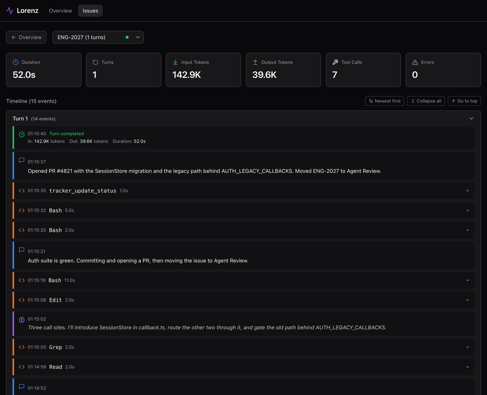

# Observability

Watch what Lorenz is doing: which agents run, what they spend, why a candidate is blocked, and what each agent did on a given issue. For operators running the daemon who want a live picture without reading logs line by line.

Lorenz exposes one source of truth and three views over it. The source is the runtime's in-memory `RuntimeSnapshot`. The views are the Ink terminal dashboard (TUI), the web dashboard, and the `lorenz runs` command. A fourth view, Traceviz, replays the full per-issue event timeline.

## The snapshot and its three views

The runtime holds a single immutable `RuntimeSnapshot`: running agents, the retry/backoff queue, dispatch blocks, run history, token usage totals, rate limits, and recent events. Every operator view reads from this one structure, so they never disagree about live state.

The path from runtime to screen is the same whichever view you open. `@lorenz/projections` keeps the bounded `recentEvents` and `runHistory` slices and deep-clones snapshot fields so a consumer can never mutate runtime state. `@lorenz/presenter` converts the camelCase snapshot into the snake_case JSON the HTTP API and WebSocket serve. `@lorenz/tui` formats the same snapshot into the terminal dashboard.

<p align="center"></p>
*One `RuntimeSnapshot` fans out through projections and the presenter into the HTTP JSON, the WebSocket `ops_state` push, and the TUI dashboard string.*

A few facts hold across all three views:

- `recentEvents` is capped at the last 20 entries, newest first.
- `runHistory` is capped at the last 50 entries, newest first.
- The presenter sets `cost.estimated_cost_usd` to `null` everywhere. Cost is reported from token totals, not dollars.
- The snapshot's `reserving` field (slots mid-acquire) is carried by projections but not surfaced in any operator view.

## The terminal dashboard (TUI)

The TUI is on by default. It renders only when `process.stdout.isTTY` is true. Pass `--no-tui` to disable it; without a TTY the runtime writes a JSON snapshot to stdout on every update instead.

It refreshes every 250ms. Throughput is a 5-second rolling window, recomputed at most once per wall-clock second. The header shows up to 10 agents.


From top to bottom:

- **Header.** Five metric panels: Agents (running count against the cap), Throughput (rolling tokens per second), Runtime, Tokens, and Rate Limits.
- **Running.** One row per active session. Each row is colored by its last event: `turn_started` is green, `turn_completed` is magenta, any other event is blue, and a row with no event yet is red.
- **Backoff queue.** The retry/backoff entries waiting to be redispatched.
- **Dispatch blocks.** Candidates the coordinator declined to start, labeled by reason: `global concurrency cap`, `local state concurrency cap`, or `worker host capacity`.

The `observability.*` config keys (`dashboard_enabled`, `refresh_ms`, `render_interval_ms`) are parsed and defaulted (`true`, `1000`, `16`), but the TUI uses the hardcoded 250ms refresh and 5-second throughput window. `refresh_ms` and `render_interval_ms` are not consumed by the TUI.

## The web dashboard

Lorenz serves a React single-page app and a JSON API from a Hono server (`startObservabilityServer`). The server is on by default; pass `--no-dashboard` to disable it.

The server binds `server.host` (default `127.0.0.1`) and `server.port` (default `4040`). Port `0` means an ephemeral port. After the bind, Lorenz rewrites `server.port` to the bound port and prints `Observability API listening on <url>` to stderr. The `--port` flag overrides `server.port`.


The Overview shows metric cards plus Running, Retry, and Blocked tables, seeded once over REST and kept live over the WebSocket. The dashboard uses a hash router: `#/` is the Overview, `#/trace/<issueId>` is the trace viewer.

If the built SPA assets are missing, `GET /` returns `503` with `{code: 'dashboard_not_built', message: 'Dashboard assets not found. Run: pnpm build'}`. Build the dashboard first.

### HTTP API and the WebSocket

The server mounts REST routes under `/api/v1`, a `/ws` WebSocket for live push, a `/health` check, and a `/mcp` endpoint. The state and run routes are registered before the catch-all `GET /api/v1/:identifier` so they are not shadowed.

| Route | Method | Purpose |
| --- | --- | --- |
| `/api/v1/state` | GET | Current ops state payload |
| `/api/v1/runs` | GET | Run history; filters `issue`, `failed`, `cost`, `retries`, `id`, `limit` |
| `/api/v1/refresh` | POST | Queue a poll + reconcile (`202`, `operations: ['poll','reconcile']`) |
| `/api/v1/:identifier` | GET | One issue's detail |
| `/api/v1/issues/recent` | GET | Recent issues (trace) |
| `/api/v1/issues/search` | GET | Issue search (trace) |
| `/api/v1/tickets` | GET | Known trace tickets |
| `/api/v1/tickets/:id/exists` | GET | Whether a trace ticket exists |
| `/api/v1/tickets/:id/events` | GET | A ticket's trace events |
| `/ws` | GET (upgrade) | Live ops_state + trace push |
| `/health` | GET | Health check |
| `/mcp` | POST | MCP endpoint |

The `runs` limit defaults to 20 and is clamped to a max of 200. On `/ws` connect the server sends `init` (tickets), then `ops_state` if a snapshot is available; the runtime broadcasts `ops_state` to connected clients on each update. The exact payload shapes, query params, and error codes are in [reference/http-api.md](reference/http-api.md).

The trace REST routes (`/api/v1/issues/*`, `/api/v1/tickets/*`) mount only when both `server.traceDir` and an `IssueStore` are present. The CLI supplies both, so they are live under the daemon.

## The runs command

`lorenz runs` queries `GET /api/v1/runs` against a running daemon and renders the result as a table or, with `--json`, as raw JSON. The daemon's observability server must be up.

The base URL precedence is `--url` (trailing slash trimmed), then `--port` when greater than 0, then the workflow's `server.port` when greater than 0. Port `0` counts as unset. With no resolvable port, the command errors.

| Flag | Effect |
| --- | --- |
| `--issue <id>` | Filter to one issue (identifier or id) |
| `--failed` | Only `failed` or `stalled` outcomes |
| `--cost` | Cost view (from token totals; dollar fields are `null`) |
| `--retries` | Retry view |
| `--id <runId>` | One run by id |
| `--limit <n>` | Cap result count |
| `--url <url>` | Explicit API base URL |
| `--port <port>` | API port on `127.0.0.1` |
| `--json` | Raw JSON instead of a table |

A `404` renders `Run not found`, a `503` renders `Observability API unavailable`. See [features/run-history.md](features/run-history.md) for what each run record carries.

## Traceviz: per-issue timelines

Where the dashboards show live aggregate state, Traceviz shows one issue's full story: every thought, message, tool call, and turn the agent produced, in order.

Capture is a 1:1 byte trail. In `apps/cli/src/main.ts`, the runtime's `onAgentUpdate` callback hands each `AgentUpdate` to `TraceEmitter.emit`, which appends one JSON line to `<traceDir>/<encodeURIComponent(issueId)>/trace.jsonl`. One runtime event becomes one trace line. The emit is fire-and-forget; writes are serialized per file. The storage key is the issue id, not its identifier, so `ENG/1` and `ENG_1` stay in separate directories, and path traversal is rejected.

`traceDir` defaults to `~/.lorenz/issues` (note `issues`, not `traces`).

<p align="center"></p>
*Each runtime `AgentUpdate` is written to `trace.jsonl`, polled by the `TraceWatcher`, parsed into `DisplayEvent`s, and pushed to the dashboard over `/ws`.*

Two pieces read those files, both from `@lorenz/traceviz-server`:

- `TraceWatcher` polls the trace directory every 500ms, reading files incrementally as they grow.
- `parseTraceLines` turns raw `TraceEvent` lines into presentation-ready `DisplayEvent`s. It coalesces consecutive message and thought chunks, pairs each `tool_call` with its `tool_call_update` to compute duration and error state, and drops runtime types (`rate_limit`, `session_started`, `process_exit`, `stderr`, `fs_write`) that have no place in the timeline.

`TraceEvent` (the on-disk line, keyed by runtime `type`) and `DisplayEvent` (the parsed UI event, keyed by `kind`) are different types. The full event vocabulary is in [reference/events.md](reference/events.md).

### Viewing a trace

Under the live daemon, open `#/trace/<issueId>` in the web dashboard. The viewer subscribes over `/ws`: it sends `{type: 'subscribe', issueId}`, receives a full `events` snapshot, then receives `events_append` deltas as the watcher detects new lines. A client scrolled away from the live edge gets a "new updates" pill instead of having its view mutated under it.



The header summarizes the run (duration, turns, token totals, tool-call count, errors); the timeline below it groups events by turn, with each thought, message, and tool call timestamped and expandable.

To inspect a single trace file outside the daemon, use the standalone viewer:

```sh
pnpm traceviz path/to/trace.jsonl
```

This loads one file at startup, computes its events and stats once, and serves a read-only viewer on `http://localhost:4040`. It prints a `#/trace/<encoded issueId>` link to open. The standalone viewer needs the dashboard built first; it does not build the UI itself.

## Logs

Lorenz writes a structured log to `logging.log_file`, default `~/.lorenz/log/lorenz.log`. The active path is surfaced in the snapshot as `log_hints.lorenz_log_file`.

To relocate the log, pass `--logs-root <path>` to the daemon; logs then go to `<path>/log/lorenz.log`. See [troubleshooting.md](troubleshooting.md) for reading the log when a run stalls.

## Configuration summary

| Key | Default | Meaning |
| --- | --- | --- |
| `observability.dashboard_enabled` | `true` | Declared and parsed; the daemon controls the web server via `--no-dashboard` |
| `observability.refresh_ms` | `1000` | Declared; not consumed by the TUI (hardcoded 250ms) |
| `observability.render_interval_ms` | `16` | Declared; not consumed by the TUI |
| `server.host` | `127.0.0.1` | Bind host for the web server |
| `server.port` | `4040` | Bind port; `0` means ephemeral; rewritten to the bound port after start |
| `server.traceDir` | `~/.lorenz/issues` | Per-issue `trace.jsonl` directory; enables trace routes with the issue store |
| `server.staticDir` | built dashboard dir | Override for the prebuilt SPA assets |
| `logging.log_file` | `~/.lorenz/log/lorenz.log` | Structured log path |

CLI flags that affect observability: `--no-tui`, `--no-dashboard`, `--port <port>`, `--logs-root <path>`. Full key reference: [reference/configuration.md](reference/configuration.md).

## See also

- [cli.md](cli.md) - the `lorenz` daemon and its flags
- [reference/http-api.md](reference/http-api.md) - exact route shapes, payloads, and error codes
- [reference/events.md](reference/events.md) - runtime, WebSocket, and trace event vocabulary
- [features/run-history.md](features/run-history.md) - what each run record carries
- [troubleshooting.md](troubleshooting.md) - diagnosing stuck or failing runs from the views and logs
